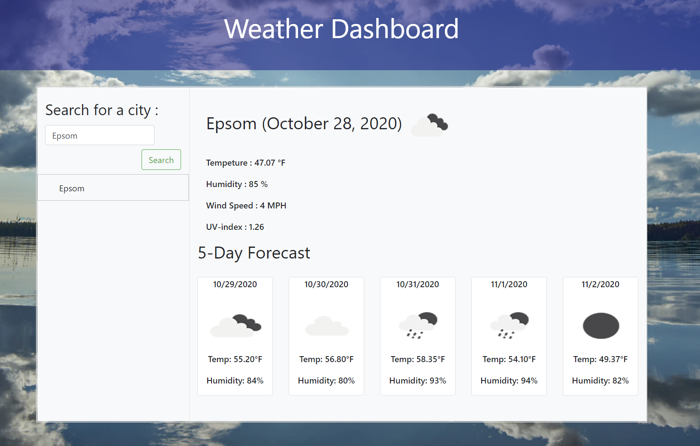

# Project: Server-Side APIs: Weather Dashboard

  Deployable Link - > https://reindeercode.github.io/Server-Side-APIs-Weather-Dashboard/

## Table of Contents: 
- [Project: Server-Side APIs: Weather Dashboard](#project-server-side-apis-weather-dashboard)
  - [Table of Contents:](#table-of-contents)
  - [License:](#license)
  - [Description:](#description)
  - [Installation Instructions:](#installation-instructions)
  - [Test Command:](#test-command)
  - [Github:](#github)
  - [My Email Address:](#my-email-address)
  - [Other Contributors:](#other-contributors)
  - [Images:](#images)

## License:

## Description:
Developers are often tasked with retrieving data from another application's API and using it in the context of their own. Third-party APIs allow developers to access their data and functionality by making requests with specific parameters to a URL. This project is focused on building a weather dashboard that will run in the browser and feature dynamically updated HTML and CSS.

## Installation Instructions: 
https://openweathermap.org/api

## Test Command: 
To launch click the deployed site link in top of read me. Enter City a click search. 

## Github: 
Check out more projects on my Github at https://github.com/ReindeerCode

## My Email Address:
If you have any questions please feel free to email me at ReindeerCode@gmail.com

## Other Contributors:
None at this time

## Images:

